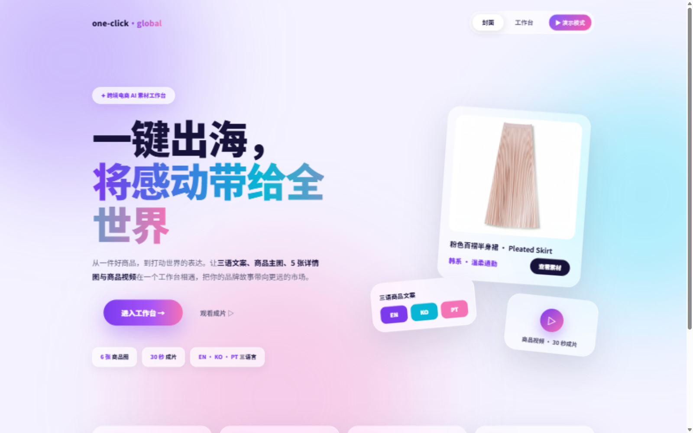
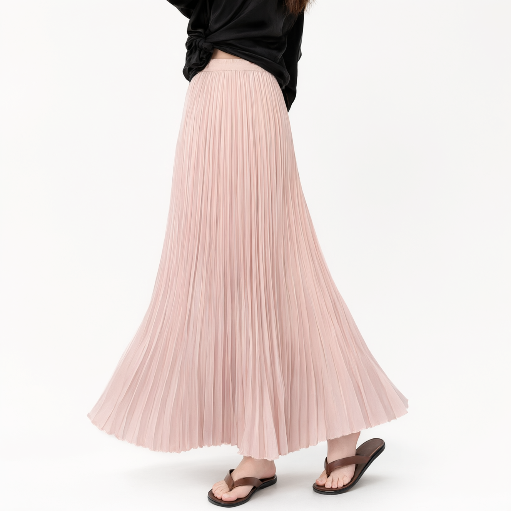
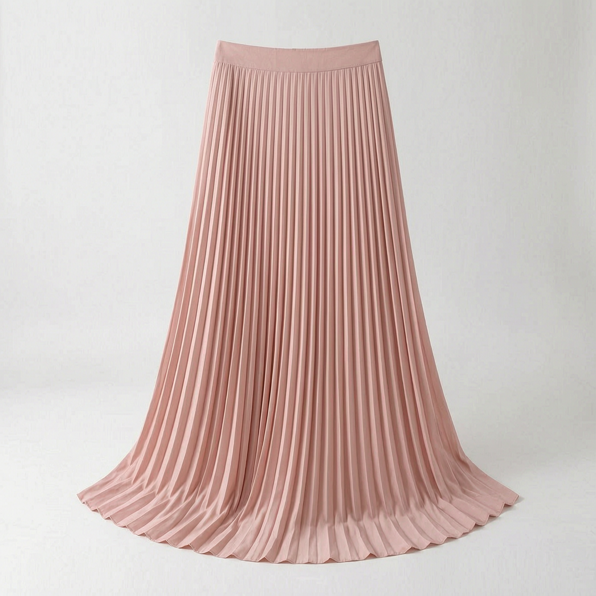
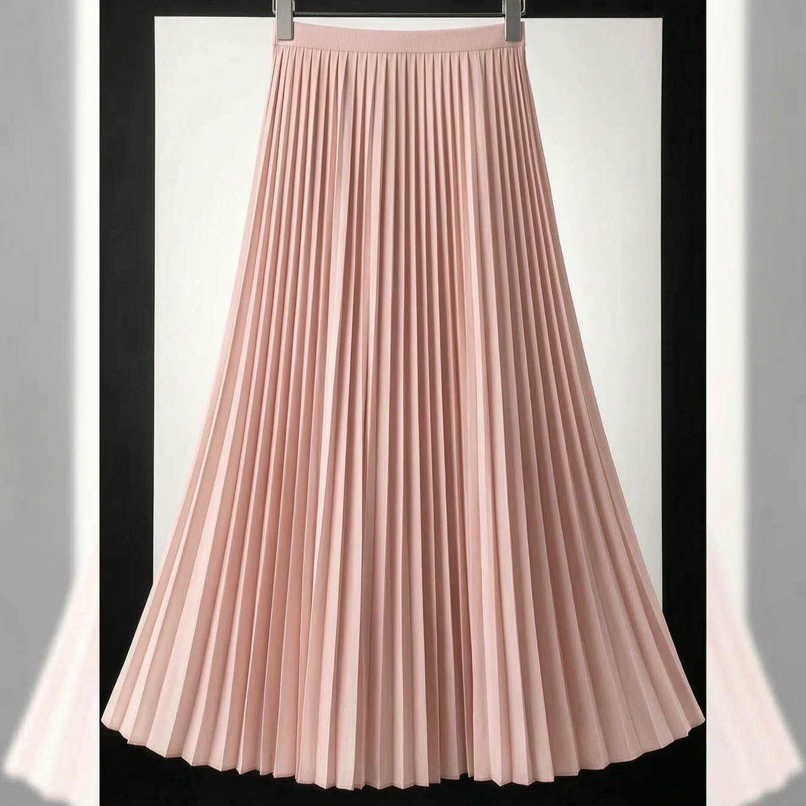
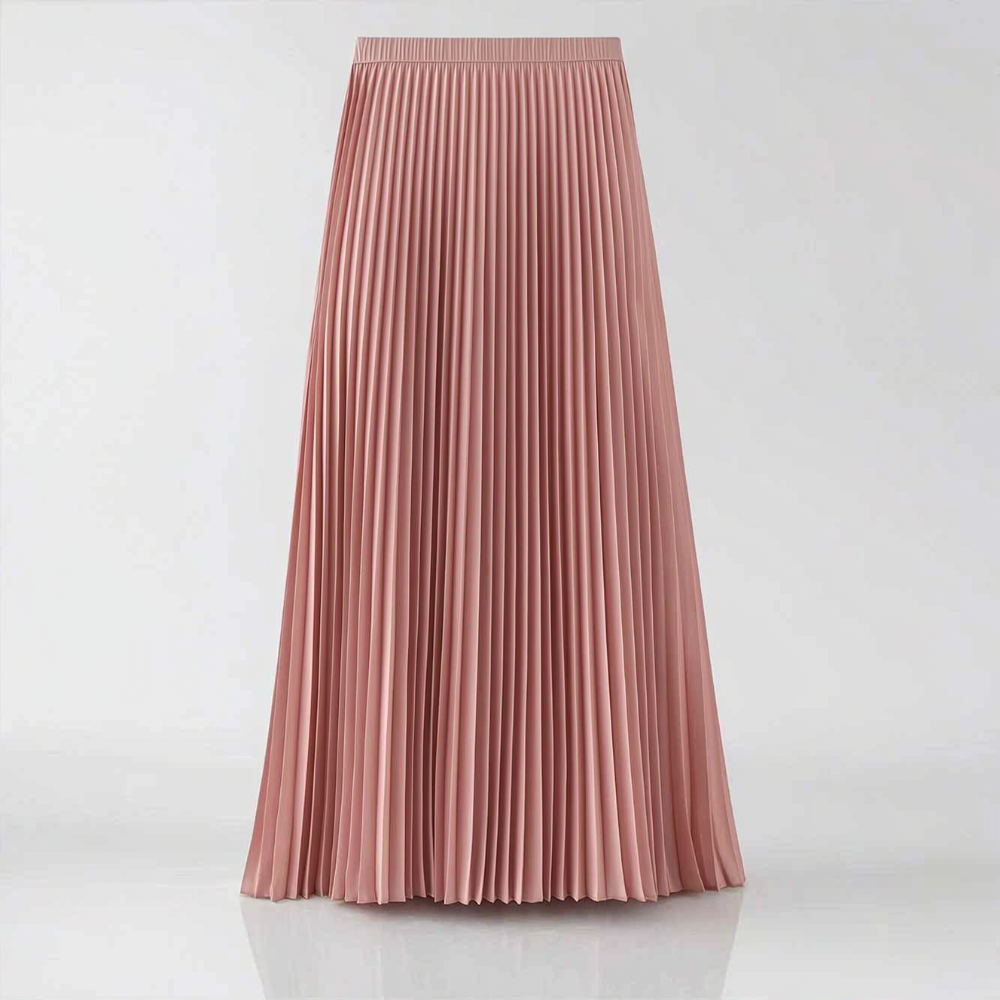
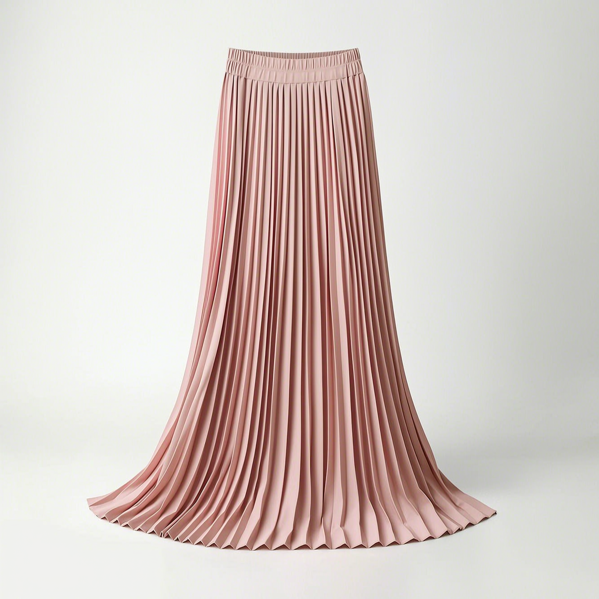
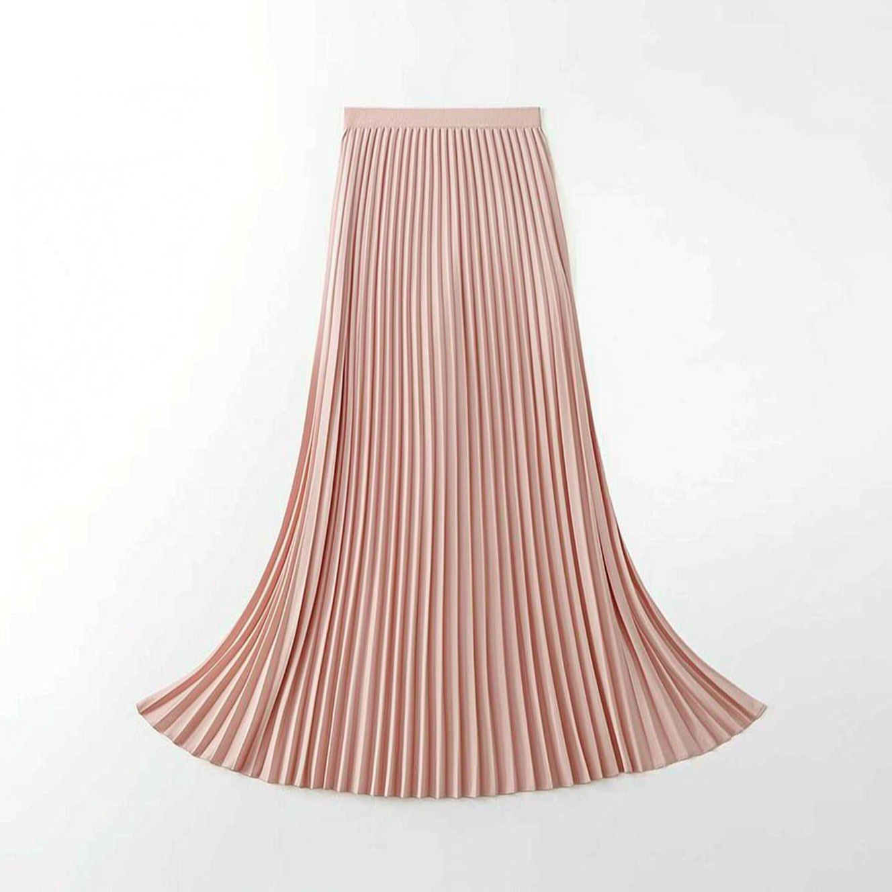
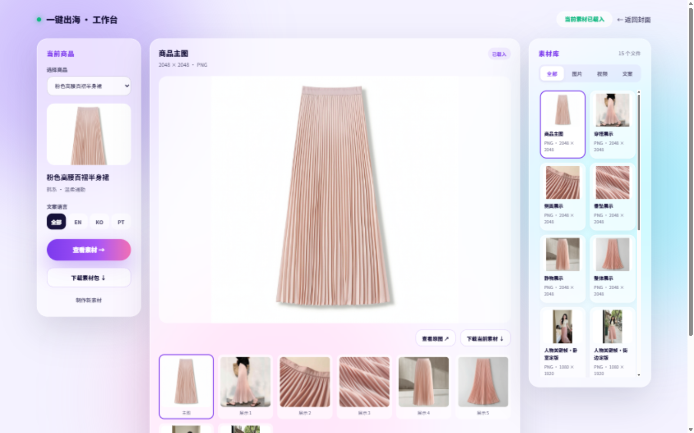

<div align="center">



[](agent/agent.json) [](#-what-a-run-produces) [](tests/) [](https://www.python.org/) [](#-license)

**One product record in, a full set of marketplace-ready localized assets out.**

[中文](README.md) · [Material Workbench](#-material-workbench) · [How videos are made](#-how-the-videos-move) · [FAQ](#-faq)

</div>

---

## ✨ What It Does

| | |
|:---:|---|
| 🛍️ | **11 marketplace-ready assets per run** — listings in three languages, 1 white-background main image, 5 detail images, 1 product video, 1 placement strategy, all with strict filenames |
| 🌏 | **Localized for three markets** — English (US), Korean (KR), Brazilian Portuguese (BR), each written in its market's style rather than translated |
| 🎬 | **Product video + character try-on short** — both a product showcase clip and a 15-second vertical try-on video, with a proven playbook for motion, rhythm, and looks ([below](#-how-the-videos-move)) |
| 👀 | **See the plan before paying** — network is off by default. Before generating anything you get a complete creative plan (storyboard, subtitles, image-slot breakdown) at zero cost |
| ✅ | **No substandard asset ships** — every asset passes size, weight, and content-completeness checks, with an explicit verdict: pass / needs review / fail |

> All images below were **actually generated** by this tool. Example product: a pink pleated maxi skirt.

---

## 🖼 Generated Asset Gallery

<table>
<tr>
<td align="center" width="33%"><br><sub><b>Main image</b> · pure white background · 2048×2048</sub></td>
<td align="center" width="33%"><br><sub><b>Overall</b> · selling points</sub></td>
<td align="center" width="33%"><br><sub><b>Craft</b> · waistband detail</sub></td>
</tr>
<tr>
<td align="center" width="33%"><br><sub><b>Drape</b> · fabric texture</sub></td>
<td align="center" width="33%"><br><sub><b>Lifestyle</b> · real-life scene</sub></td>
<td align="center" width="33%"><br><sub><b>Overview</b> · complete, uncropped</sub></td>
</tr>
</table>

The product video and the character try-on short can be viewed in the [Material Workbench](#-material-workbench).

---

## 📦 What a Run Produces

**11 required assets** with fixed filenames that downstream listing flows consume directly:

| # | Asset | Files | Notes |
|:---:|:---:|---|---|
| 1–3 | Listings | `product_description_en.md` / `_ko.md` / `_pt.md` | EN / KO / BR-PT · six sections: selling points, specs, size chart, source, and more |
| 4 | Main image | `main_image.png` | Pure white background · 2048×2048 · complete product |
| 5–9 | Detail images | `detail_image_1.png` – `detail_image_5.png` | Overall / craft / drape / lifestyle / overview — one job each, no overlap |
| 10 | Product video | `product_video.mp4` | Vertical clip under 30 seconds · under 200MB |
| 11 | Strategy doc | `strategy_document.md` | Selling points, image assignments, video storyboard, placement advice |

<details>
<summary><b>Companion files (click to expand)</b></summary>

| File | Purpose |
|---|---|
| `listing.json` | Structured index of all assets for system integration |
| `quality_report.json` | Per-asset check results and acceptance verdicts |
| `generation_plan.json` | The pre-generation creative plan (storyboard, subtitles, image slots) |
| `product_video_srt.srt` | Sidecar video subtitles (never burned into the picture) |
| `run_manifest.json` | Run record of the session |

</details>

---

## 🎬 How the Videos Move

The tool produces two kinds of video: a **product showcase** (opens on the product image, five-part structure under 30 seconds: hook → pain point → product → proof → call to action) and a **15-second character try-on short** (1080×1920 vertical). Both draw on the same playbook, validated on real finished clips.

### Where the motion comes from

- **The first frame is caught mid-motion** — the try-on video's first frame is not a standing pose; it is the instant where weight is on one leg and the hem is already lifting. The video model continues from that momentum, so the clip opens already moving instead of standing still for the first seconds.
- **A 16-move library, arranged by tier** — weight shifts, hip pops, figure-8 sways, two-step grooves, shoulder hits, arm waves, a confident walk toward camera, one slow skirt-flaring turn, an over-shoulder glance, a final hair-tuck pose. Every move is tagged with its beat length and generation risk: reliable moves go straight in, risky ones get protective phrasing, reliably broken ones are banned outright.
- **Three finished tiers, degrade on failure** — full-body groove (first choice) → walk-in interaction → in-place groove fallback. If a tier renders poorly, the next tier is used once — never retried endlessly — so what ships is always a playable clip.

### Where the platform-native feel comes from

- **Motion-stop contrast creates the beat** — one perceivable change every 2.5–4 seconds; a 15-second clip has three acts (rise → body → final pose) with at most five changes total. Sharp freezes against smooth flow act as built-in beat drops once BGM is added.
- **Direct-to-camera interaction** — eye contact throughout, ending on a glance back, a hair tuck, a smile. That "she's showing this to me" parasocial feel is what separates native content from an ad.
- **Fabric motion is the proof** — the skirt flares, swings through its momentum, and settles: a complete cause-and-effect chain that only motion can demonstrate. The moment a viewer sees how the skirt moves is the moment they want it.
- **UGC phone-shot texture** — handheld vlog camera feel, real window light, visible skin texture and stray hairs instead of a studio-retouched commercial look. The review checklist even requires "keep one imperfection".
- **Built for 100% completion** — the final pose connects back to the opening momentum so the clip loops seamlessly, engineering replay into the video itself.

### Where the good looks come from

- **Style follows the product** — five style families (Korean soft, US clean-bold, Brazilian warm, minimal studio, premium editorial) are matched to the product automatically; the pink skirt lands on Korean soft-commute.
- **Composition discipline** — the camera stays locked at full-body distance, the subject fills about two-thirds of the frame height, empty space is left on the motion side, and background clutter stays under three items, all blurred.
- **Tasteful realism** — makeup described in five layers, at most two accessories, a color palette limited to tones that flatter the product — engineered against the "AI plastic" look.
- **Frame-by-frame inspection before shipping** — finished clips are spot-checked frame by frame: all three acts present, skirt physics intact, hands normal, feet not sliding, face not drifting, background stable, final pose centered on the product. Failures are regenerated at a lower tier — never handed to you broken.

---

## 🚀 Quick Start

**Requirements: Python 3.12 or newer, nothing to install.**

Real generation needs an API key from the [Qwen platform](https://platform.qianwenai.com); the first two steps do not.

### Step 1 · Offline rehearsal (no network, no cost)

```bash
cd agent
python3 agent.py --plan-only --prompt "Read all information files for the target product under /path/to/input/, extract the specified content, and write the generated files to /path/to/output/."
```

Within seconds the output directory contains `generation_plan.json`: what will be generated, how the six image slots divide their jobs, and how the video is storyboarded — review the plan before spending anything.

### Step 2 · Local dry run (no network, no cost)

```bash
python3 tests/mock_e2e.py
```

Walks the full pipeline on the sample product with simulated generation, confirming the environment and flow work.

### Step 3 · Real generation (consumes platform credits)

```bash
export DASHSCOPE_API_KEY="<your-key>"
export DASHSCOPE_BASE_URL="https://dashscope.aliyuncs.com/api/v1"
export OPENAI_BASE_URL="https://dashscope.aliyuncs.com/compatible-mode/v1"
export AGENT_ALLOW_PAID_CALLS=1        # authorization switch: without it, nothing can ever be billed

cd agent
python3 agent.py --prompt "Read all information files for the target product under /path/to/input/, extract the specified content, and write the generated files to /path/to/output/."
```

When it finishes, open `quality_report.json` — each asset is marked pass or needs review at a glance.

> 💡 Use an **empty output directory**. If assets from a previous run are present, the tool refuses to start so old and new assets can never be mixed up.

### Step 4 · Open the Material Workbench

```bash
python3 -m http.server 18765 --bind 127.0.0.1 --directory frontend
```

Visit `http://127.0.0.1:18765/workbench.html` to browse, filter, and download every asset.

### Command Cheat Sheet

| Command | Purpose |
|---|---|
| `agent.py --plan-only --prompt "..."` | Creative plan only — no generation, no cost |
| `agent.py --prompt "..."` | Generate all 11 assets (needs API key + authorization switch) |
| `agent.py --audit <output-dir>` | Check existing assets for quality, generates nothing |
| `agent.py --check-plan <plan.json>` | Validate a creative plan file |
| `agent.py --version` | Print the version |

**The exit code is the verdict** once a run finishes: `0` all passed → ready to use; `2` complete but human review recommended; `1` something is missing or failed.

---

## ⚙️ Configuration

| Variable | Needed for | Purpose |
|---|:---:|---|
| `DASHSCOPE_API_KEY` | Real generation | Qwen platform API key |
| `DASHSCOPE_BASE_URL` | Real generation | Fixed: `https://dashscope.aliyuncs.com/api/v1` |
| `OPENAI_BASE_URL` | Real generation | Fixed: `https://dashscope.aliyuncs.com/compatible-mode/v1` |
| `AGENT_ALLOW_PAID_CALLS=1` | Real generation | Paid-call authorization switch. **Without it the tool is fully offline** — even with a key configured, nothing can be billed |

Security conventions: the API key enters only through environment variables, never written to any file; keys are automatically redacted from logs and run records.

---

## 🖥 Material Workbench

A single-file web page with zero dependencies. Serve it and open `frontend/workbench.html`:



- **Asset library** — filter by type (images / video / copy) and by language (EN / KO / PT)
- **Full-size preview** — click any asset for a lightbox view; thumbnail strip for quick switching
- **In-browser listings** — the three listings render with real typography; copy the full text with one click
- **Per-asset / bulk download** — take what you need or package everything at once
- For scrubbable video, start `python3 tools/preview_server.py` instead (port 18766)

---

## ✅ Quality Promises

| Promise | What it means |
|:---:|---|
| 🚫 Nothing invented | Composition, certifications, or specs absent from the source data never appear in the assets; sizes without measured data are marked as missing, never converted to fill the table |
| 📐 Specs met | White-background 2048×2048 main image; 2048×2048 detail images; video under 200MB; images and video are genuinely the format their extension claims |
| 🎬 Video genuinely playable | File integrity and true duration are checked section by section; short or corrupted files are stopped |
| 🧾 Transparent verdicts | Every asset gets pass / needs review / fail — what the machine verified and what needs human eyes are kept separate |
| 🔒 Costs contained | Fully offline by default; real generation needs its own authorization switch, so accidental billing is impossible |

---

## ❓ FAQ

<details>
<summary><b>How much does one set of assets cost?</b></summary>
<br>

It depends on the Qwen platform's pricing for each model; the tool itself charges nothing. The rehearsal steps (`--plan-only`, `tests/mock_e2e.py`) are completely free; real generation makes several text, image, and video model calls. With the authorization switch off, no calls happen even with a key configured.

</details>

<details>
<summary><b>Which products are supported?</b></summary>
<br>

A clothing category and attribute library is built in (66 mappable leaf categories covering tops, bottoms, dresses, shoes, and accessories). Product data is supplied as source JSON containing title, SKUs, attributes, and images.

</details>

<details>
<summary><b>How long are the videos?</b></summary>
<br>

Two formats: the product showcase runs under 30 seconds (automatically shortened to a 15-second plan when the time budget is tight, so it never times out mid-clip); the character try-on short is fixed at 15 seconds, 1080×1920 vertical, roughly 360 frames minimum.

</details>

<details>
<summary><b>Can I rename the asset files?</b></summary>
<br>

The 11 required assets use a fixed naming convention — please don't rename them; the listing flow and quality report index everything by these names. Companion files likewise.

</details>

<details>
<summary><b>Can the assets go straight onto the marketplace?</b></summary>
<br>

Spec-wise (dimensions, white background, file size, format) they ship compliant; content-wise everything a machine can check (factual consistency, language purity, no banned claims) is already checked. When the exit code is `2` or a listing is marked "needs review", have a native speaker give it a read before listing.

</details>

---

## 📁 Repository Layout

```
cross-border-material-agent/
├── agent/          # the generation tool itself (Python source + entry point)
├── tests/          # 183 offline regression tests
├── frontend/       # material workbench + real assets generated by this tool
├── docs/           # usage docs, video creation playbook, screenshots
├── research/       # market and asset research notes
└── README.md       # this file
```

## 📄 License

MIT License. Research notes are compiled from publicly available sources.
