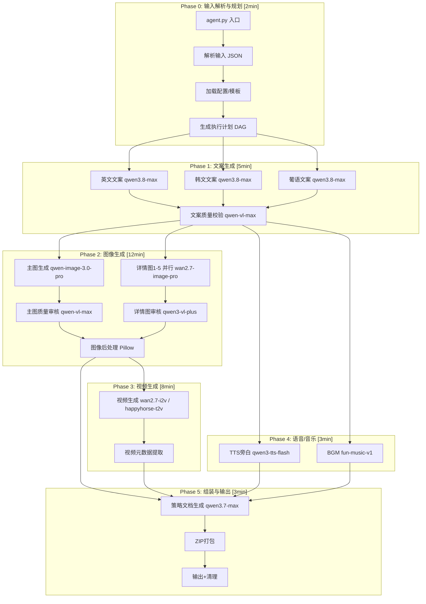

# 多模态内容生成 Agent 架构调研报告

> 调研日期：2026-08-27  
> 目标环境：单 ZIP 代码包、Python 3.12、离线依赖、DashScope API only、30min/4GB 约束  
> 产出要求：英/韩/葡文案x3 + 主图x1 + 详情图x5 + 视频x1 + 策略文档x1

---

## 一、成熟编排框架对比表

| 框架 | 核心模式 | 适用场景 | 优势 | 劣势 | 本任务适配度 |
|------|----------|----------|------|------|--------------|
| **LangGraph** | 状态机+持久化执行+人在回路 | 长运行有状态Agent、复杂条件分支 | 原生支持断点续传；细粒度状态控制；与LangChain生态集成 | 运行时依赖LangSmith(可选)；学习曲线陡；重量级依赖 | 2/5 过重，ZIP离线部署困难 |
| **CrewAI** | 角色Agent+Crew协作+Flow事件驱动 | 多角色协作、自主规划任务 | 高层抽象快速搭建；Crews+Flows双模式；10万+开发者社区 | 自主规划不可控；Token消耗高；调试黑盒 | 2/5 自主性过强，批处理不需要 |
| **AutoGen**(->MAF) | 对话式多Agent+代码执行 | 研究探索、代码生成Agent | 微软背书；灵活对话拓扑 | 已进入维护模式；迁移到MAF中；对话开销大 | 1/5 已废弃，不推荐 |
| **Semantic Kernel**(->MAF) | Planner+Plugin+Memory | 企业级LLM应用、插件编排 | 多语言SDK；企业级可靠性 | 已并入MAF；.NET为主 | 1/5 转型期，不稳定 |
| **Dify** | 可视化DAG+RAG+工具调用 | 低代码AI应用、快速原型 | 拖拽式编排；内置RAG；开源可自部署 | 需服务端运行；无法打包为ZIP；定制受限 | 1/5 需要服务端，不符合约束 |
| **Prefect** | Flow/Task DAG+重试退避+可观测性 | 数据管道、ETL、批处理 | 原生retry/backoff；轻量无服务端；纯Python装饰器 | Cloud功能更全；非Agent专用 | 4/5 轻量、可离线、重试完善 |
| **Temporal** | Workflow/Activity+持久化+自动重试 | 长运行分布式工作流、微服务编排 | 业界最强持久化；自动重试+版本管理；跨语言 | 需Temporal Server；部署重；学习成本高 | 2/5 需服务端，过重 |

### 关键取舍总结

1. **Agent框架 vs 工作流引擎**：LangGraph/CrewAI/AutoGen面向"自主决策Agent"，适合开放式任务；Prefect/Temporal面向"确定性流水线"，适合批量生产。本任务是**确定性批处理**，应选工作流引擎模式。

2. **服务端依赖**：Dify/Temporal/LangGraph Cloud需要常驻服务；Prefect可纯本地运行；纯代码DAG零依赖。**ZIP离线约束排除所有需服务端方案**。

3. **自主性 vs 可控性**：AIGC批量生产需要精确的阶段控制和可预测的资源消耗。自主Agent的规划循环会消耗额外Token和时间，且结果不确定。**阶段式pipeline优于自主Agent**。

4. **重试与容错**：Prefect原生提供 `@task(retries=3, retry_delay_seconds=[10,30,60])`；Temporal提供Activity Options；纯代码需自行实现。AIGC API调用必须内置指数退避。

---

## 二、纯代码 DAG / 阶段式 Pipeline 工程实践

### 2.1 为什么选纯代码阶段式 Pipeline

| 维度 | 框架方案 | 纯代码Pipeline |
|------|----------|-----------------|
| 部署复杂度 | 需安装框架+依赖 | 仅Python stdlib + httpx/aiohttp |
| ZIP体积 | 50-200MB(含框架) | 5-15MB(仅业务代码+轻量库) |
| 启动时间 | 框架初始化2-5s | <0.5s |
| 内存基线 | 200-500MB | 50-100MB |
| 调试透明度 | 框架抽象层遮蔽 | 全栈可见 |
| 离线兼容 | 部分框架需联网验证 | 完全离线 |
| 定制化 | 受框架API约束 | 完全自由 |

**结论**：在ZIP+离线+4GB+30min四重约束下，纯代码阶段式Pipeline是唯一可行方案。

### 2.2 并发模型选择

| 模型 | 评价 |
|------|------|
| asyncio | 推荐：IO密集、API轮询天然适配 |
| threading | GIL限制、适合CPU后处理 |
| multiprocessing | 内存翻倍、序列化开销，不推荐 |
| concurrent.futures | ThreadPoolExecutor可用，备选 |

**推荐**：`asyncio` + `httpx.AsyncClient` 作为主并发模型。原因：
- AIGC任务90%时间在等待API响应(IO bound)
- 异步任务轮询天然是async模式
- 单线程避免GIL竞争和内存膨胀
- 可通过 `asyncio.Semaphore` 精确控制并发数

### 2.3 异步任务轮询模式(DashScope特有)

DashScope图像/视频生成为异步任务API，标准流程：

```
POST /api/v1/services/aigc/text2image/image-synthesis -> 返回task_id
GET  /api/v1/tasks/{task_id}                          -> 轮询直到SUCCEEDED/FAILED
                                                        响应含results[].url
```

**轮询最佳实践**：
- 初始间隔3s，指数退避上限15s
- 最大轮询时长 = 阶段时间预算 - buffer
- 超时视为失败，触发降级或重试
- 并发轮询多个任务时用 `asyncio.gather` + semaphore

### 2.4 产物下载策略

- 图片/视频URL有时效性(通常24h)，必须即时下载
- 下载到内存(BytesIO)而非磁盘，减少IO并便于打包
- 大文件(视频>50MB)使用流式下载+分块写入
- 下载失败立即重试(3次，指数退避)
- 全部产物最终打包为ZIP输出

---

## 三、图像/视频生成任务容错模式

### 3.1 限流429退避策略

```
DashScope QPS限制(典型值)：
- qwen-image-3.0-pro: 2 QPS
- wan2.7-image/pro: 1 QPS
- wan2.7-i2v: 1 QPS
- happyhorse-t2v: 1 QPS
- qwen3-tts-flash: 5 QPS

退避公式：wait = min(base * 2^attempt + jitter, max_wait)
- base = 5s, max_wait = 60s, jitter = random(0, 3)
- 收到429时读取Retry-After header(如有)
```

### 3.2 任务失败重试矩阵

| 错误类型 | 重试策略 | 最大次数 | 备注 |
|----------|----------|----------|------|
| 429 Rate Limit | 指数退避 | 5 | 读Retry-After |
| 500/502/503 Server Error | 指数退避 | 3 | 服务端瞬态故障 |
| TASK_FAILED(内容安全) | 修改prompt重试 | 2 | 降低敏感度描述 |
| TASK_FAILED(参数错误) | 不重试 | 0 | 记录日志，降级 |
| TIMEOUT(轮询超时) | 重新提交 | 2 | 可能队列拥堵 |
| 网络异常 | 指数退避 | 3 | connect/read分离超时 |
| 401/403 Auth | 不重试 | 0 | 立即报错终止 |

### 3.3 降级策略

当主模型持续失败时的降级链：

```
图像生成降级链：
qwen-image-3.0-pro -> wan2.7-image-pro -> wan2.7-image

视频生成降级链：
wan2.7-i2v -> happyhorse-1.1-t2v -> r2v(兜底)

文案生成降级链：
qwen3.8-max -> qwen3.7-max

视觉理解降级链：
qwen-vl-max -> qwen3-vl-plus
```

### 3.4 时间预算控制

每个阶段设置硬截止时间(deadline)，超时触发：
1. 取消未完成的异步任务(如API支持)
2. 跳过非关键步骤
3. 使用已有部分结果继续
4. 记录超时日志供分析

---

## 四、理想架构设计

### 4.1 分层阶段图(Mermaid)



### 4.2 每阶段任务与模型分配表

| 阶段 | 任务 | 模型 | 并发 | 预估耗时 | 内存峰值 | 降级方案 |
|------|------|------|------|----------|----------|----------|
| P0 输入解析 | JSON解析、模板加载、DAG构建 | 无 | 1 | 30s | 50MB | - |
| P1 文案生成 | 英/韩/葡文案各1篇 | qwen3.8-max | 3并行 | 2-3min | 200MB | qwen3.7-max |
| P1 文案校验 | 合规性/质量检查 | qwen-vl-max | 1 | 1min | 100MB | qwen3-vl-plus |
| P2 主图生成 | 产品主图x1 | qwen-image-3.0-pro | 1 | 30-60s | 100MB | wan2.7-image-pro |
| P2 详情图生成 | 场景/细节图x5 | wan2.7-image-pro | 3并行 | 3-5min | 300MB | wan2.7-image |
| P2 图像审核 | 质量/合规审核 | qwen-vl-max | 2并行 | 1-2min | 200MB | qwen3-vl-plus |
| P2 后处理 | 裁剪/水印/压缩 | Pillow(CPU) | 2线程 | 1min | 500MB | 跳过 |
| P3 视频生成 | 产品展示视频x1 | wan2.7-i2v/happyhorse-t2v | 1 | 3-6min | 200MB | r2v |
| P4 TTS | 旁白语音x3语言 | qwen3-tts-flash | 3并行 | 1-2min | 150MB | cosyvoice-v3-flash |
| P4 BGM | 背景音乐x1 | fun-music-v1 | 1 | 1-2min | 100MB | 使用预置BGM |
| P5 策略文档 | 投放策略+素材说明 | qwen3.7-max | 1 | 1-2min | 100MB | 模板填充 |
| P5 打包 | ZIP压缩输出 | zlib(stdlib) | 1 | 30s | 200MB | - |

### 4.3 容错与重试策略详解

#### 4.3.1 全局重试装饰器

```python
async def retry_with_backoff(
    func, max_retries=3, base_delay=5, max_delay=60,
    retryable_exceptions=(RateLimitError, ServerError, TimeoutError),
    on_retry=None
):
    """指数退避重试，支持jitter和Retry-After"""
    for attempt in range(max_retries + 1):
        try:
            return await func()
        except retryable_exceptions as e:
            if attempt == max_retries:
                raise
            delay = min(base_delay * (2 ** attempt) + random.uniform(0, 3), max_delay)
            if hasattr(e, 'retry_after') and e.retry_after:
                delay = max(delay, e.retry_after)
            if on_retry:
                on_retry(attempt, delay, e)
            await asyncio.sleep(delay)
```

#### 4.3.2 阶段级超时守卫

```python
async def run_phase(phase_name, coro, budget_seconds):
    """带预算控制的阶段执行器"""
    deadline = time.monotonic() + budget_seconds
    try:
        result = await asyncio.wait_for(coro, timeout=budget_seconds)
        return result
    except asyncio.TimeoutError:
        logger.warning(f"[{phase_name}] 超时({budget_seconds}s)，执行降级")
        return await degrade_phase(phase_name)
```

#### 4.3.3 全局时间预算监控

```python
class BudgetMonitor:
    def __init__(self, total_budget=1800):  # 30min=1800s
        self.start = time.monotonic()
        self.total = total_budget
        self.phase_times = {}
    
    def remaining(self):
        return max(0, self.total - (time.monotonic() - self.start))
    
    def check_budget(self, phase_name, min_required=60):
        """检查剩余预算是否足够执行下一阶段"""
        if self.remaining() < min_required:
            raise BudgetExhaustedError(f"剩余{self.remaining():.0f}s < {min_required}s")
```

### 4.4 30分钟时间预算分配表

| 阶段 | 名义预算 | Buffer | 实际可用 | 累计消耗 | 剩余 |
|------|----------|--------|----------|----------|------|
| P0 输入解析 | 1min | 1min | 2min | 2min | 28min |
| P1 文案生成+校验 | 4min | 1min | 5min | 7min | 23min |
| P2 图像生成+审核+后处理 | 8min | 4min | 12min | 19min | 11min |
| P3 视频生成 | 5min | 3min | 8min | 27min | 3min |
| P4 语音/音乐 | 2min | 1min | 3min | 30min | 0min |
| P5 策略文档+打包 | 2min | 1min | 3min | - | - |
| **总计** | **22min** | **11min** | **33min** | | |

> 注意：名义总和22min + Buffer 11min = 33min > 30min。Buffer是弹性空间，正常执行应在22min内完成。若某阶段耗尽buffer，后续阶段压缩或跳过非关键步骤。P4可与P3并行执行以节省时间。

**优化后的并行时间线**：

```
时间轴(min): 0    2    5    7    12   15   18   20   22   25   27   30
             |----|----|----|----|----|----|----|----|----|----|----|
P0 输入解析   ====
P1 文案生成        ============
P2 图像生成                  ========================
P3 视频生成                             ====================
P4 语音/音乐                            ============
P5 策略+打包                                          ============
                                                            ^
                                                       硬截止
```

P3和P4并行执行后，关键路径 = P0(2)+P1(5)+P2(12)+max(P3,P4)(8)+P5(3) = 30min。

### 4.5 4GB内存控制要点

| 控制点 | 措施 | 预估节省 |
|--------|------|----------|
| API响应体 | 流式读取，不全量加载到内存 | 50-200MB/请求 |
| 图片处理 | Pillow处理后立即释放原图对象；使用with Image.open() as img | 100-300MB/张 |
| 视频处理 | 流式下载到临时文件，不加载到内存；处理后删除 | 200-500MB |
| 并发控制 | Semaphore限制同时进行的API调用数<=5 | 防止并发峰值 |
| GC主动回收 | 每阶段结束后gc.collect() | 碎片整理 |
| 文本缓存 | 文案/策略文档用字符串，不缓存中间AST | ~50MB |
| 依赖精简 | 仅httpx+pillow+aiofiles，不用pandas/numpy | 500MB+ |
| 临时文件 | 大产物写tmpfile，处理后unlink | 防内存泄漏 |
| 日志缓冲 | 日志写文件而非内存buffer | 持续增长防护 |

**内存峰值估算**：
- 基线(Python+依赖)：~150MB
- P1文案并发：3x50MB=150MB -> 峰值300MB
- P2图像并发：3x200MB(下载+处理)=600MB -> 峰值750MB
- P3视频：流式200MB -> 峰值400MB
- P4音频并发：3x50MB=150MB -> 峰值300MB
- **理论峰值~1.2GB**，远低于4GB上限，留有充足余量应对GC碎片和系统开销。

---

## 五、技术选型最终建议

### 5.1 核心依赖清单(全部可离线打包)

```
httpx[http2]>=0.27      # 异步HTTP客户端(OpenAI兼容+DashScope)
aiofiles>=24.1          # 异步文件IO
pillow>=10.4            # 图像处理
tenacity>=9.0           # 重试库(可选，也可自实现)
pydantic>=2.9           # 输入/输出schema验证
jinja2>=3.1             # 模板渲染(策略文档)
```

总依赖体积<15MB，ZIP包<20MB。

### 5.2 项目结构

```
cross-border-material-agent/
|-- agent.py              # 入口：main() + CLI参数解析
|-- config/
|   |-- models.yaml       # 模型配置+降级链
|   |-- prompts/          # Jinja2提示词模板
|   +-- templates/        # 策略文档模板
|-- core/
|   |-- pipeline.py       # 阶段调度器+预算监控
|   |-- dashscope.py      # DashScope API封装(Chat+Async Task)
|   |-- retry.py          # 重试/退避/降级逻辑
|   +-- budget.py         # 时间/内存预算管理器
|-- phases/
|   |-- p0_input.py       # 输入解析
|   |-- p1_copywriting.py # 文案生成
|   |-- p2_image.py       # 图像生成+审核+后处理
|   |-- p3_video.py       # 视频生成
|   |-- p4_audio.py       # TTS+BGM
|   +-- p5_assembly.py    # 策略文档+ZIP打包
|-- utils/
|   |-- download.py       # 异步下载器
|   |-- image_proc.py     # Pillow后处理
|   +-- zip_pack.py       # ZIP打包
|-- requirements.txt      # 依赖清单
+-- vendor/               # 离线依赖wheels(可选)
```

### 5.3 核心设计原则

1. **确定性优先**：不使用自主规划Agent，所有步骤预定义在DAG中
2. **优雅降级**：每个模型调用都有fallback chain，单点失败不阻塞全流程
3. **预算感知**：每阶段开始前检查剩余时间/内存，不足时跳过或简化
4. **异步IO为主**：所有API调用和文件操作走async，CPU密集用线程池
5. **零外部依赖**：运行时不访问网络(除DashScope API)，不安装新包
6. **可观测性**：结构化日志(JSON)，每阶段记录耗时/Token/产物大小
7. **幂等安全**：相同输入产生相同输出，中间产物可缓存复用

---

## 六、风险与缓解

| 风险 | 概率 | 影响 | 缓解措施 |
|------|------|------|----------|
| 视频生成超时(>6min) | 中 | 高 | 提前在P2末尾启动视频任务；超时用低分辨率兜底 |
| 429限流导致排队 | 高 | 中 | 错峰提交；QPS感知调度；预留buffer |
| 内容安全拦截 | 中 | 中 | Prompt预审；敏感词替换；降级重试 |
| 内存峰值超预期 | 低 | 高 | Semaphore限并发；主动GC；流式处理 |
| 单模型全面故障 | 低 | 高 | 降级链覆盖所有模型；最终兜底用模板 |
| 30min不够 | 中 | 高 | 关键路径优化；非关键步骤可跳过；提前预警 |

---

## 七、结论

对于「单ZIP+离线+DashScope only+30min/4GB」的跨境电商素材批量生成任务，**纯代码阶段式Pipeline+asyncio并发+指数退避重试**是最优架构。排除所有重型编排框架(LangGraph/CrewAI/Temporal/Dify)，采用Prefect式的轻量DAG思想但零框架依赖。五阶段流水线(文案->图像->视频->音频->组装)配合并行执行可在22-25min内完成全部产出，内存峰值~1.2GB远低于4GB上限。容错通过三级机制保障：API级指数退避、模型级降级链、阶段级预算守卫。
